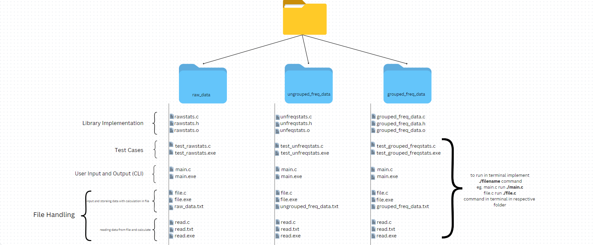

Statistics Libraries in C
-------------------------

## Project Description

This project consists of three separate C libraries for statistical calculations. Each library is specialized for different types of data:

1. Raw Data: A simple collection of unstructured data.
2. Ungrouped Frequency Data: Data with corresponding frequencies but without class intervals.
3. Grouped Frequency Data: Data with corresponding frequencies grouped into class intervals.

The libraries calculates statistical measures such as Mean, Mode, and Median of all three different types of data.

## Goals
The main goals of the project are:
1. Provide reusable libraries to calculate basic statistical measures for different data types.
2. Allow flexible user interaction via terminal input/output and file handling.
3. Implement test cases for validation of the libraries' accuracy and performance.
4. Allows user to input data and store that data in file with their calculation.
5. Allow users to read data from files and output the statistical measures to the terminal.
6. In future to add more statsical measures so if want to use C for creating machine learning models which requires statstical calculations.

## Specifications

Each library provides the following functions:
1.  Mean Calculation:
   - For raw data, ungrouped frequency data, and grouped frequency data using the direct mean method.
2.  Median Calculation:
   - Sorts the data and calculates the central value (or average of two middle values for even data sets).
3.  Mode Calculation:
   - Finds the most frequent value in the data set.

The libraries are designed to handle large integer and floating-point values for flexibility.

### Key Features:
1. Raw Data Library: Handles one-dimensional arrays of raw data.
2. Ungrouped Frequency Data Library: Manages two arrays (observations and frequencies) and computes the mean, mode, and median.
3. Grouped Frequency Data Library: Manages class intervals, corresponding frequencies, and computes the statistical measures.

## Design

Each repository has the following structure:

1.  Library Implementation:
   - Contains the core functions to calculate mean, median, and mode.

2.  User Input and Output (CLI):
   - Users can input raw data, ungrouped frequency data, or grouped frequency data.
   - The results (mean, mode, median) are printed directly to the terminal.

3.  Test Cases:
   - Each library includes a separate test file with predefined test cases for validating the calculations.

4.  File Handling:
   - Users can store input data and calculated statistics (mean, mode, median) in a file.
   - A separate feature allows users to read from a file and display the statistics in the terminal.

   image of design 